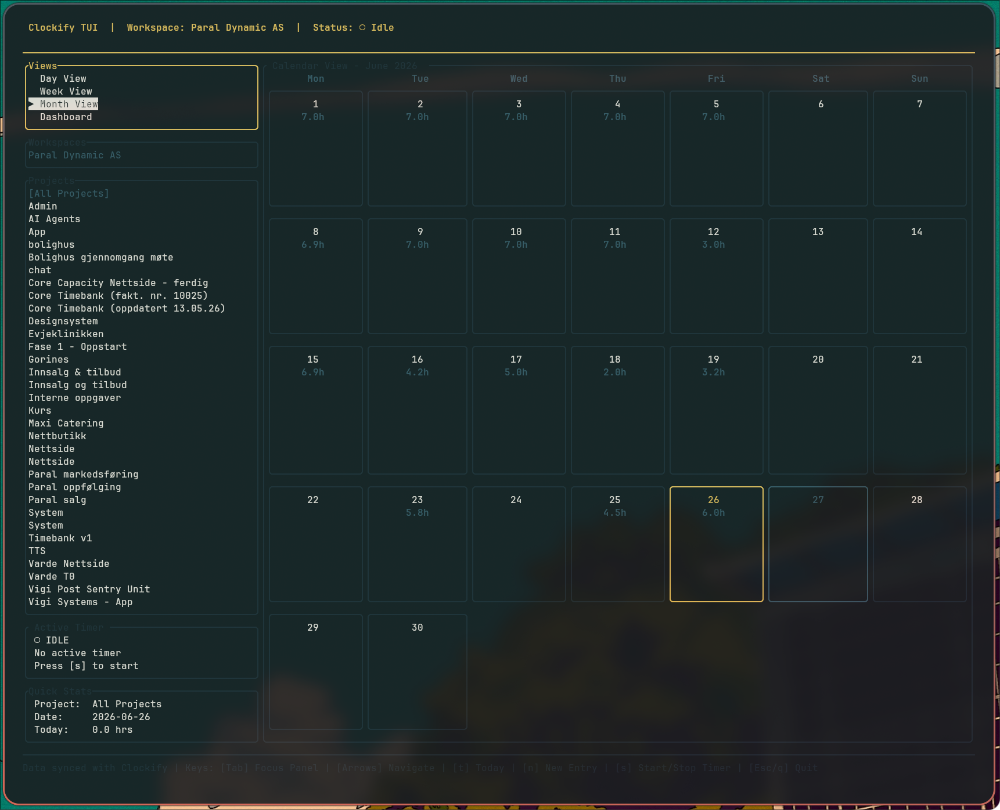

# clockify tui



uses Clockify API together with your account API Token to get access to simple CRUD operations on your Clockify data.


### usage
```bash
clockify auth --token <your_api_token>
```

then just simply start the TUI with:
```bash
clockify
```
